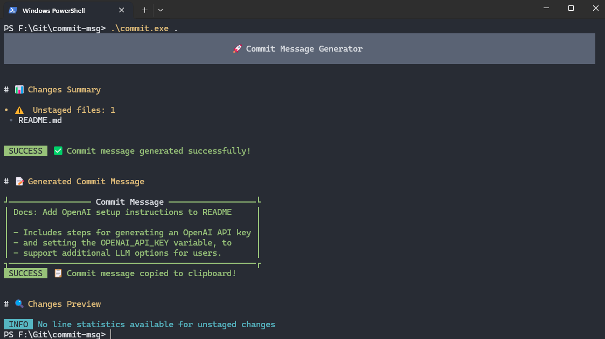

# commit-msg

`commit-msg` is a command-line tool that generates commit messages using LLM. It is designed to help developers create clear and concise commit messages for their Git repositories. - btw i accept this from auto-complete

## Screenshot

Below is a sample execution of `commit-msg`:



Before running the application, ensure you have set the system environment variables.

## You can Use Gemini or Grok as the LLM to Generate Commit Messages

### Add `COMMIT_LLM` value are `gemini` or `grok`

### Add `GROK_API_KEY` to System Variables (if use grok)

### Add `GEMINI_API_KEY` to System Variables (if use gemini)

---

## Setup


### Download the latest release and set the in the path variables then you can use `commit .` in any git repo

To set up `commit-msg`, run the following command:

```bash
go run src/main.go --setup --path F:/Git/commit-msg --name commit-msg
```


---

## Usage

To run `commit-msg`, use:

```bash
go run src/main.go --path F:/Git/commit-msg
```

This will execute `commit-msg` in the current directory:

```bash
go run src/main.go .
```

---

## Download

To download the latest release of `commit-msg`, visit the [GitHub Releases](https://github.com/dfanso/commit-msg/releases) page and follow the installation instructions for your platform.


